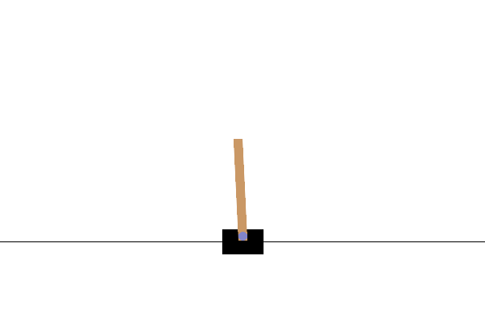

# CartPole Reinforcement Learning

## Contents
- [Description](#description)
- [Demonstration](#demonstration)
- [Potential improvements](#potential improvements)
- [Usage](#usage)
- [Conclusion](#conclusion)
- [References](#references)

## Description

This project is an implementation of Deep Q Learning using OpenAI Gym's CartPole environment. The aim of the project is to experiment with Reinforcement Learning techniques and develop a model that can effectively balance the CartPole for as long as possible. The project provides a clear and concise example of how to use the Gym environment and Q-Learning algorithm to solve a simple yet interesting RL problem.


## Demonstration

### Random Policy

We can see that the pole naturally falls.

https://user-images.githubusercontent.com/93766133/222061538-2120787b-3e8c-4845-b3a0-7de0211064c2.mp4

### Policy with Deep-Q Learning

There is some significant improvement with Deep-Q Learning.
However we can see that the policy does not balance the pole fully.
This is because the policy is "lazy" and can still maintain the pole long enough to win the game.

https://user-images.githubusercontent.com/93766133/222061524-50424fe1-f01f-4eb0-a3d6-a08188b076cb.mp4

### Hard-Coded Policy

It turns out we can fix this problem by using a very simple-policy which is simple to understand intuitively:

- If $\theta$ is small enough, the pole is next to the equilibrium position. In this case we only look at $\omega$ to move the cart in the direction the pole is falling.
- Else, the pole is already far from the equilibrium position. We look at $\theta$ to correct the position.





## Potential improvements

We can act on the rewards to improve the behaviour of the cart and improve energy efficiency:

- In the stock gym environment, the reward is 1 at each time step until the pole falls. We can create a reward that is higher when the pole is closer to the vertical position. $\cos(\theta)$ seems like a good reward function.
- Ideally we also want the cart to stay still when the pole is next to the equilibrium. We can do that by penalizing the reward each time a left or right action is taken.


## Usage


 - Clone the repository
 ```bash
 git clone 'git@github.com:FrancoisPorcher/cartpole-reinforcement-learning.git' 
 ```
 - Install dependencies
 ```bash
 run the google collab file
 ```


## Conclusion

I had a lot of fun doing this short project. This project is great starting point for anyone interested in learning about Reinforcement Learning, particularly using Deep Q Learning.
It demonstrates the use of OpenAI Gym and provides practical insights into how to train and evaluate RL models. The project can be easily extended to other environments and algorithms for more advanced RL tasks.

## References

> - [1] [OpenAI - Gym](https://www.gymlibrary.dev). 
> - [2] Richard S. Sutton and Andrew G. Barto [Reinforcement Learning: An Introduction](https://web.stanford.edu/class/psych209/Readings/SuttonBartoIPRLBook2ndEd.pdf). 
> - [3] [Deep Q-Learning](https://en.wikipedia.org/wiki/Q-learning). 


                                                    


